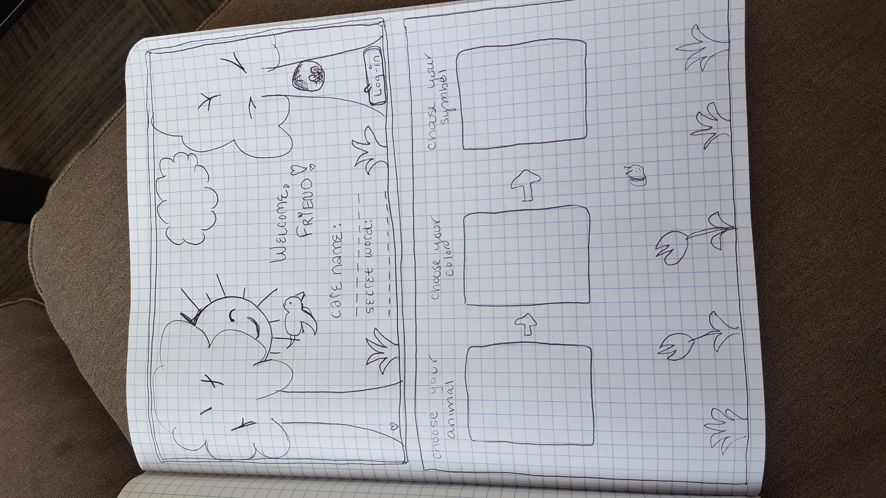
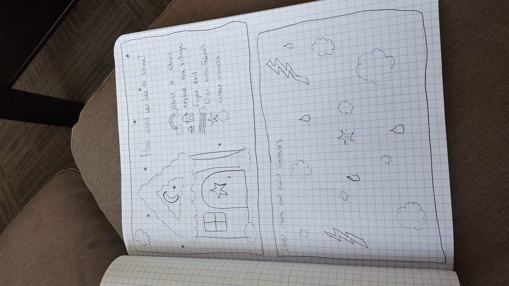
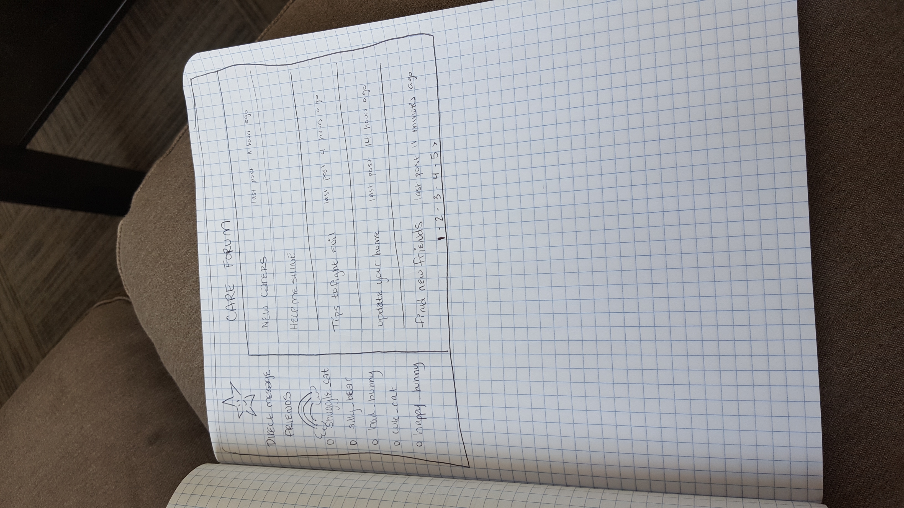

<!-- Twitter icon from https://github.com/carlsednaoui/gitsocial -->
[1.1]: http://i.imgur.com/tXSoThF.png (twitter icon with padding)

# _Care Site_

#### _Mock-up Care Bear Inspired Site_
_UI - Week 2: Web Design Process_

#### **Dawn Mott** :sunrise_over_mountains: _May 30th, 2018_

## Description

_This app is a fun, friend based game_

## Specs
_Simple mockup, hand drawn on paper_

* Below: Welcome page and avatar selector

 
* Below: Home page and cloud collecting game

 
* Below: Care forum

## Setup/Installation Requirements

* Clone this repository
* Or just look at the pics in my readme

## Known Bugs

_There are many known :bug: at this time, this is a work in progress_

## Support and contact details

_If you'd like to chat, please contact_ @dawnrparty _on_ ![alt text][1.1]

## Technologies Used

_HTML, CSS, and flattery_

### License

*This page is licensed under the MIT license*

&copy; 2018 **Dawn Mott** :sunrise_over_mountains:
